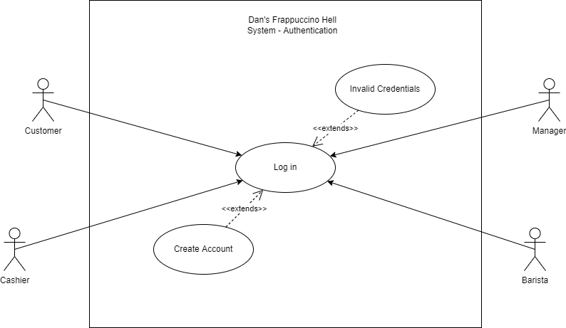
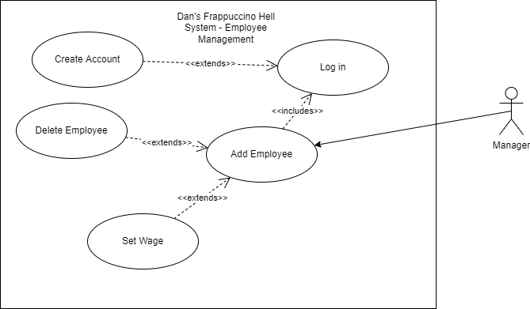
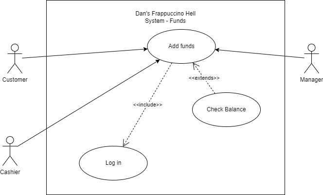
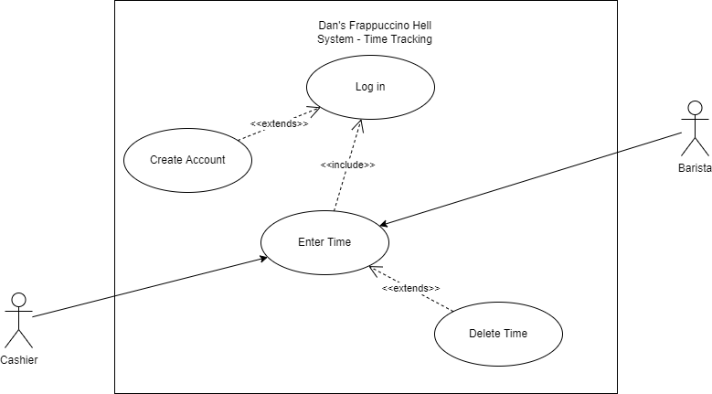
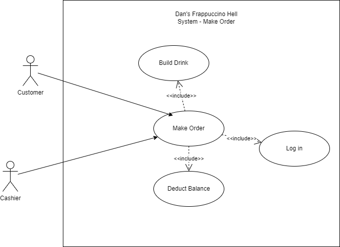
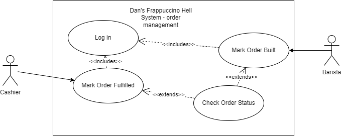
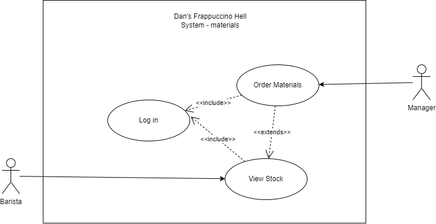
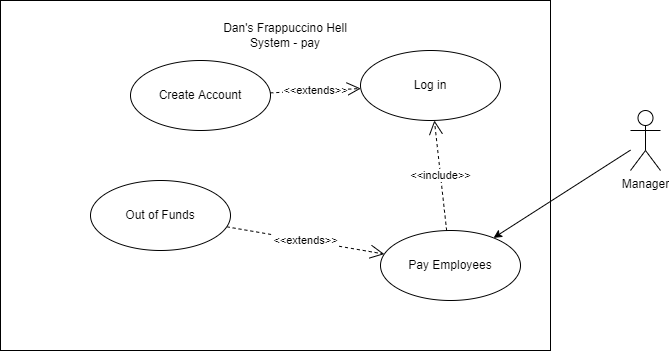

# Use Case Diagram
## 1. Auth

- Name: Log in
	- Participating actor: Customer, Cashier, Barista, Manager
	- Entry Condition:
		- Actor is on login page
	- Exit Condition:
		- Actor has been granted access to the system
	- Event flow:
		1. Actor Enters Credentials
		2. Actor Hits Log in
- Name: Create Account
	- Participating actor: Customer, Cashier, Barista, Manager
	- Entry Condition:
		- Actor is on login page
	- Exit Condition:
		- Account for the actor exists in the database
	- Event flow:
		1. Actor creates username
		2. Actor creates valid password
		3. Actor hits create account button
- Name: Invalid Credentials
	- Participating actor: Customer, Cashier, Barista, Manager
	- Entry Condition:
		- Actor supplied incorrect credentials for account
	- Exit Condition:
		- Actor has been returned to login screen
	- Event flow:
		1. System displays invalid credentials message
		2. Login prompt is returned to Actor
## 2. Employee Management

- Name: Add Employee
	- Participating actor: Manager
	- Entry Condition:
		- Actor is logged in
		- Actor enters add employee page
	- Exit Condition:
		- Existing account has been upgraded to employee status
	- Event flow:
		1. Manager searches for userid to promote
		2. Manager sets wage
		3. Manager hits 'promote to employee' button
- Name: Delete Employee
	- Participating actor: Manager
	- Entry Condition:
		- Actor is logged in
		- Actor enters add employee page
	- Exit Condition:
		- Employee Account has been demoted to customer
	- Event flow:
		1. Manager searches for userid to demote
		2. Manager hits 'remove employee' button
- Name: Set Wage
	- Participating actor: Manager
	- Entry Condition:
		- Actor is logged in
		- Actor enters add employee page
	- Exit Condition:
		- Employee Wage is set
	- Event flow:
		1. Manager searches for userid to set wage
		2. Manager sets wage in $/hr
		3. Manager hits 'save'
## 3. Funds Management

- Name: Add funds
	- Participating actor: Customer, Manager, Cashier
	- Entry Condition:
		- Actor is logged in
		- Actor enters add funds page
	- Exit Condition:
		- Actor has added funds to their account (personal or corporate)
	- Event flow:
		1. Actor navigates to add funds page
		2. Actor selects amount of funds to add
		3. Actor hits "Add funds button"
- Name: Check Balance
	- Participating actor: Customer, Manager, Cashier
	- Entry Condition:
		- Actor is logged in
		- Actor enters add funds page
	- Exit Condition:
		- Actor has seen the funds in their account (personal or corporate)
	- Event flow:
		1. Actor navigates to add funds page
		2. Actor is presented with current funds
## 4. Time Tracking

- Name: Enter Time
	- Participating Actor: Barista or Cashier
	- Entry Condition:
		- Actor is logged in
		- Actor is in Time enter page
	- Exit Condition:
		- Logged hours are saved to the actor's account
	- Event flow:
		- Actor selects amount of hours to add to timecard
		- Actor hits "add hours" button
		- Hours are saved to actor's account
- Name: Delete Time
	- Participating Actor: Barista or Cashier
	- Entry Condition:
		- Actor is logged in
		- Actor is in Time enter page
	- Exit Condition:
		- Logged hours are removed from the actor's account
	- Event flow:
		- Actor selects amount of hours to remove from timecard
		- Actor hits "remove hours" button
		- Hours are saved to actor's account
## 5. Make Order

- Name: Make Order
	- Participating actor: Customer or Manager
	- Entry Condition:
		- Actor is logged in
		- Actor has drinks in their cart
		- Customer has sufficient funds in their account
	- Exit Condition:
		- Actor pays for their order
	- Event flow:
		1. Actor Adds any number of drinks to cart
		2. Actor goes to "checkout"
		3. Funds are deducted from Customer account
		4. Order is added to backlog
- Name: Build Drink
	- Participating actor: Customer or Manager
	- Entry Condition:
		- Actor is logged in
		- Actor is on menu page
	- Exit Condition:
		- Actor adds drink to cart
	- Event flow:
		1. Actor Picks base drink
		2. Actor chooses size
		3. Actor chooses extras
		4. Actor hits add to cart
- Name: Deduct Balance
	- Participating actor: Customer or Manager
	- Entry Condition:
		- Actor is logged in
		- Actor has submitted an order
	- Exit Condition:
		- Actor's account balance has been deducted
	- Event flow:
		1. Total price of submitted order is calculated
		2. Balance is deducted from the Actor's account
## 6. Order Management

- Name: Mark Order Built
	- Participating Actor: Barista
	- Entry Condition:
		- Actor is logged in
		- Actor is on active orders page
	- Exit Condition:
		- Order status has been changed
	- Event Flow
		1. Actor selects order to modify
		2. Barista marks order as completed
		3. Order is updated in backend
- Name: Mark Order Fulfilled
	- Participating Actor: Cashier
	- Entry Condition:
		- Actor is logged in
		- Actor is on active orders page
	- Exit Condition:
		- Order status has been changed
	- Event Flow
		1. Actor selects order to modify
		2. Cashier marks order as fulfilled
		3. Order is updated in backend
- Name: Check Order Status
	- Participating Actor: Barista or Cashier
	- Entry Condition:
		- Actor is logged in
		- Actor is on active orders page
	- Exit Condition:
		- Order status has been displayed
	- Event Flow
		1. Actor enters orders screen
		2. Active orders are displayed
## 7. Stock Management

- Name: View Stock
	- Participating Actor: Manager or Barista
	- Entry Condition:
		- Actor is logged in
		- Actor is on available stock page
	- Exit Condition:
		- Amount of each ingredient available in stock is listed
	- Event Flow
		1. Actor enters stock screen
		2. Stock is displayed
- Name: Order Materials
	- Participating Actor: Manager
	- Entry Condition:
		- Actor is logged in
		- Actor is on order stock page
	- Exit Condition:
		- Stock has been added to account
	- Event Flow
		1. Manager selects amount of each ingredient they'd like to purchase
		2. Manager hits 'order now' button
		3. Value is deducted from store Account
		4. Stock is added to account.
## 8. Pay Employees

- Name: Pay Employees
	- Participating Actor: Manager
	- Entry Condition:
		- Actor is logged in
		- Actor is on payroll
	- Exit Condition:
		- Employees have been paid
	- Event Flow
		1. Manager selects employee timecard(s) to approve
		2. Manager Marks 'approved'
		3. Funds are added to employee accounts
- Name: Out of Funds
	- Participating Actor: Manager
	- Entry Condition:
		- Actor is logged in
		- Actor is on payroll
		- Store does not have enough funds to pay employees
	- Exit Condition:
		- ISF notice is displayed
	- Event Flow
		1. Insufficient funds message is displayed when there are insufficient funds