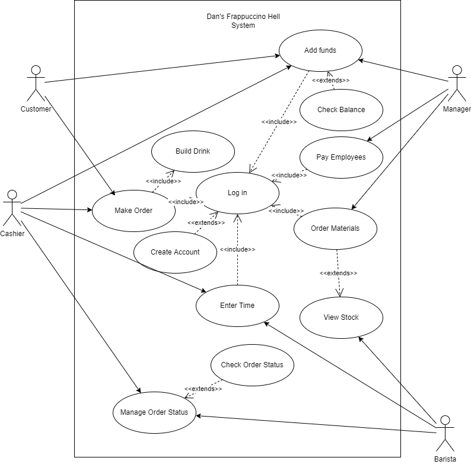

# Use Case Diagram

- Name: Add funds
	- Participating actor: Customer or Manager
	- Entry Condition:
		- Actor is logged in
		- Actor enters add funds page
	- Exit Condition:
		- Actor has added funds to their account (personal or corporate)
	- Event flow:
		1. Actor navigates to add funds page
		2. Actor selects amount of funds to add
		3. Actor hits "Add funds button"
- Name: Make Order
	- Participating actor: Customer or Manager
	- Entry Condition:
		- Actor is logged in
		- Actor has drinks in their cart
		- Customer has sufficient funds in their account
	- Exit Condition:
		- Actor pays for their order
	- Event flow:
		1. Actor Adds any number of drinks to cart
		2. Actor goes to "checkout"
		3. Funds are deducted from Customer account
		4. Order is added to backlog
- Name: Manage Order Status
	- Participating Actor: Barista or Cashier
	- Entry Condition:
		- Actor is logged in
		- Actor is on active orders page
	- Exit Condition:
		- Order status has been changed
	- Event Flow
		1. Actor selects order to modify
		2. Barista marks order as completed or Cashier marks order as fulfilled
		3. Order is updated in backend
- Name: Enter Time
	- Participating Actor: Barista or Cashier
	- Entry Condition:
		- Actor is logged in
		- Actor is in Time enter page
	- Exit Condition:
		- Logged hours are saved to the actor's account
	- Event flow:
		- Actor selects amount of hours to add to timecard
		- Actor hits "add hours" button
		- Hours are saved to actor's account
		